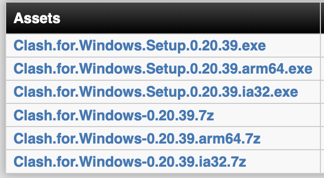
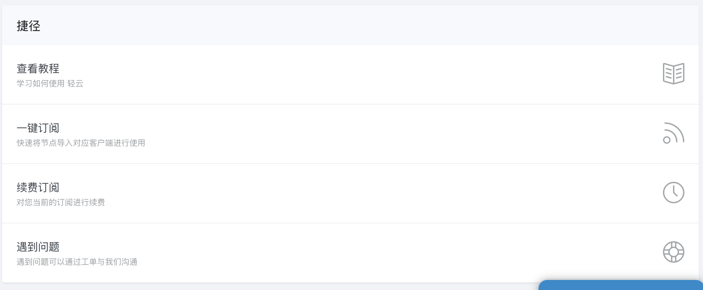
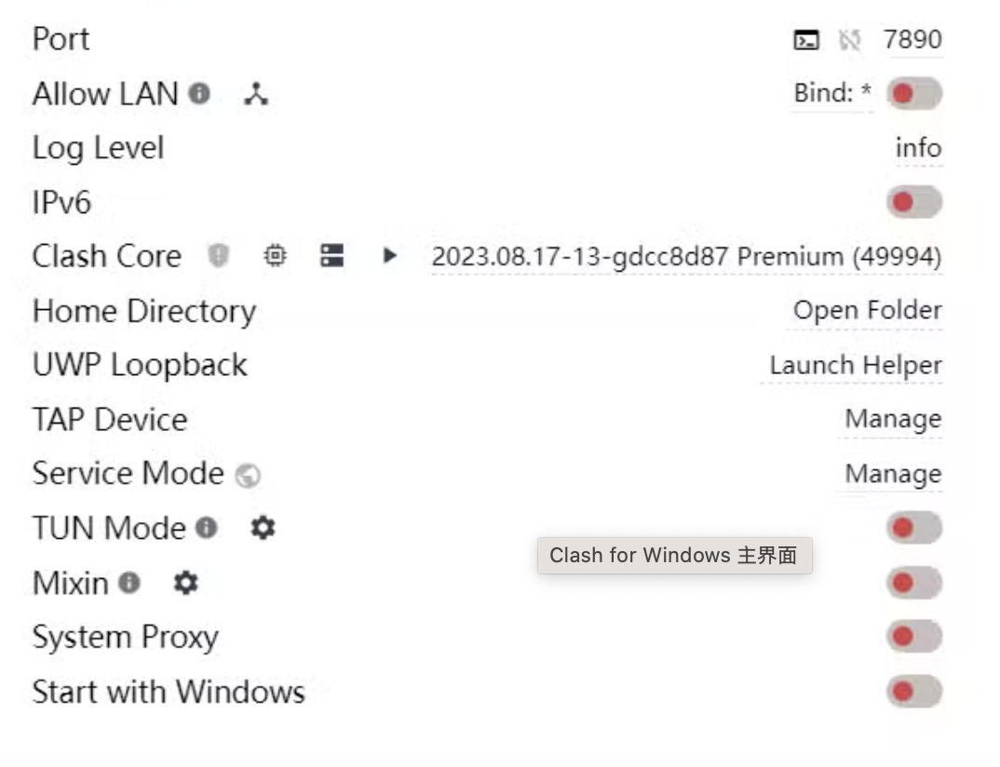

# 科学上网导航

#### **教程简介**
由于身边许多朋友在浏览互联网时因连接方式的限制无法访问部分网络服务，本教程旨在通过调整连接方式和配置`Proxy`代理的实用方法来解决这些问题。

教程以实践为主，避免过多理论讲解。只需具备基本的 Windows 操作知识（例如安装应用程序），即可轻松上手。
### 1.引言
本教程适用于 Windows 系统（x64 架构），主要使用的工具是在开源社区`GitHub`提供的 [Clash for Windows](https://downloads.clash.wiki/clash_for_windows_pkg/)。
### 2.准备工作
#### 2.1下载安装软件

我们需要从[Clash.wiki中获取](https://downloads.clash.wiki/clash_for_windows_pkg/)`Clash.for.Windows.Setup.0.20.39.exe`(第一个就是x64文件)
接下来在文件目录中找到`exe`文件点击正常安装。
> ⚠︎ 为避免此源头被污染，社区有对此文件做备份工作。

<!--d_clash.png-->



#### 2.2 注册购买机场链接
##### 2.2.1 什么是机场？
机场是提供科学上网服务的网络供应商，其主要服务项目是提供Shadowsocks、V2ray、Trojan等翻墙协议的节点服务器。
> ⚠︎ 搭建机场技术难度不高，很多自建机场容易圈钱跑路，建议选择业内口碑好的平台。
> ⚠︎ 选择一元机场或者免费机场/`vpn`要慎重，虽然便宜但技术和线路质量无法保障，有一定安全隐患

Clash是一款网络代理工具，支持多种节点服务器的协议。只需导入各机场提供的配置文件即可一键`Proxy`代理。你可以在注册机场后从官方文档中学习如何配置。

##### 2.2.2 注册使用
> 可以通过谷歌检索出许多可供选择的机场，大部分机场使用方法是类似的，这里我们用到[轻云](https://cf.loveqyun.cyou/#/register?code=YUJ1x7YZ)提供的节点服务器做演示。

打开[轻云](https://cf.loveqyun.cyou/#/register?code=YUJ1x7YZ)在注册页面邮箱注册即可，进入后可以阅读官方文档`查看教程`选择`clash for windows`中的教程已经很详细了。
<!--q_yun.png-->


### 3.教学内容
#### 3.1 导入配置文件
^4b7891
<!--profiles.png-->

在`profiles`词条中导入配置文件。可以直接从URL链接中自动导入，也可以用`import`从电脑中选取文件。

大多数机场已有成熟教程，并与其节点兼容，这里不再多赘述。遇到问题可通过 GitHub issue 提问，我会在一周内回复，或直接联系我的微信。

#### 3.2 讲解各代理模式各功能
<!--proxies.png-->


在左边的词条中的`Proxies`中可以选择模式。最主要的有`Global`, `Rule`, `Direct`这三种模式，新版新增加里`Script`模块。

理解这些并不难，可以把它比作一台带滤水器的水龙头：
- **Global** 模式就像让所有的水都通过滤水器，意味着所有流量都会走代理。
- **Direct** 模式相反，相当于水直接流出，不经过滤水器，所有流量直连网络。
- **Rule** 模式则像多个水龙头分流：一些水流直接排出（不过滤），另一些则通过滤水器（代理）。这里的“水流出口”可以理解为目标网站的域名。
- **Script**模式翻译过来就是脚本，简单点理解就像是自己编程自己自定义。
#### 3.3 开启关闭代理

<!--general.png-->

这次我们会讲到词条`General`:
- `System Proxy`是**最主要的选项**，我们在`Proxies`中选择了我们模式，之后也要打开`System Proxy`选项才能开始代理。
- `Mixin`中译为混合代理, 就是**指在可以直连可以的情况下使用直连，出错使用代理连接**，机场一般都会提供给你好他们的写好的配置，也可以自己写代码配置。
- `TUN Mode`这个比较厉害, TUN 模式是**Windows 系统中的一种虚拟网络接口模式**。它可以用来处理 TCP、UDP、ICMP 流量。使用 Clash TUN 的最大优势之一是内置支持对操作系统路由表、路由规则和 nftable 的自动管理。虽然听起来技术性很强，但简单来说，TUN Mode 可以让整个操作系统的网络流量都挂上代理，包括你平时可能忽略的后台服务流量，真正实现全局代理的便利性和兼容性。
#### 3.4 验证是否成功
设置完让我们测试一下是否成功
>可用于测试的网站:
>- https://www.google.com/
>- https://maps.google.com/
>- https://scholar.google.com/
>- https://www.youtube.com/
>- https://www.sci-hub.mk/

**浏览器验证法**: 在浏览器 url 输入网址查看是否可以成功链接
**ping 验证**: 在cmd, powershell, terminal中ping域名查看是否会丢包。
```bash
dum@sxxw$ ping www.xxxx.com
```

### 4.总结
从简来说，只要下载完软件，通过机场下载配置文件，在`Profiles`词条中添加配置文件。然后在`Proxies`中选取`Global`全局代理，并选取一个代理服务器(比如 香港_01)。最后我们打开`System Proxy`从浏览器中测试是否可以使用谷歌。最后可以按照喜好配置选择`Mixin`, `TUN Mode`
> ⚠︎ 浏览器的选择，最好用Edge，Chrome，Firefox这些。尽量不要用360，搜狗，百度这些。大陆浏览器容易屏蔽你的访问。

#### 了解更多
工具学习文档
[Clash中文界面](https://clashforwindows.org)
[Clash知识库](https://clash.wiki)
[Clash高级使用教程](https://docs.reiz.link/附录/clash-advanced-usage/)

实战应用博客
[ Steam 如何绕过 Clash 全局代理](https://cornradio.github.io/hugo/posts/%E8%AE%A9steam%E7%BB%95%E8%BF%87clash%E7%B3%BB%E7%BB%9F%E4%BB%A3%E7%90%86/)
